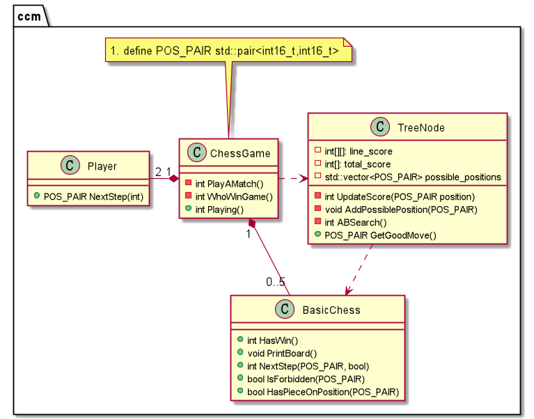

# FiveChessWithAI
A five chess game which support PVP&amp;PVE mode. It is a project of UCAS C++ course.


## Design Principle
The PVE mode use decision tree to play the chess.
In order to have a deeper tree, I use alpha-beta pruning algorithm to prune the tree.

How to build a decision tree you can see [this blog](https://kimlongli.github.io/2016/12/14/%E5%A6%82%E4%BD%95%E8%AE%BE%E8%AE%A1%E4%B8%80%E4%B8%AA%E8%BF%98%E5%8F%AF%E4%BB%A5%E7%9A%84%E4%BA%94%E5%AD%90%E6%A3%8BAI/).

The structure of this project just like the flowing class diagram shows.



## Quick Start
This project use cmake to build, you should first install cmake.
```shell
mkdir build
cd build
cmake ..
make
chmod +x ./bin/fivechess
./bin/fivechess
# The UI works well with font SONG(宋) and Shell bash.
```

If you want to change the parameters, this is a table to record all the parameters.

| Name        | Default Value | Note                                                         |
| ----------- | ------------- | ------------------------------------------------------------ |
| TOTAL_MATCH | 5             | How many matches of a game?                                  |
| BOARD_SIZE  | 15            | The size of the chess board                                  |
| MAX_DEPTH   | 3             | The depth of decision tree. The program works much better when the depth is 4, but it will take more time. |

